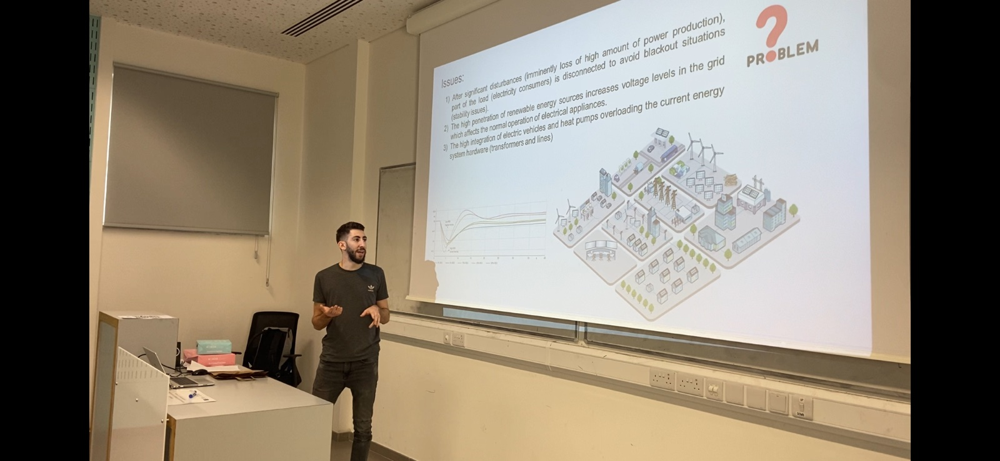

The SPS Lab participated in an inspiring event organized by the Learning Development Network at the Cyprus University of Technology (CUT). The event brought together postgraduate students, PhD candidates, and postdoctoral researchers in a vibrant and engaging setting. The highlight? Presenting our research in just 3 minutes!

The experience was both challenging and rewarding. Summarizing complex research into a short, impactful presentation pushes you to focus on the essence of your work. It was also incredible to see how others, from various fields, tackled their own projects and communicated their findings with clarity and enthusiasm.

As part of the DENSE project, Savvas Panagi presented his work on the Optimal Operation of Electric Vehicles (EVs) and Heat Pumps (HPs) in Active Distribution Grids. His talk emphasized innovative approaches to energy management, demonstrating how EVs and HPs can contribute to sustainable and efficient power grids.

Beyond the presentations, the event provided a fantastic opportunity to connect with peers and academics. We exchanged ideas, discussed methodologies, and explored potential collaborations. It was a reminder of the strength of the research community at CUT and the value of sharing knowledge.

If you ever get the chance to participate in such an event, don’t hesitate. It’s a platform to grow, learn, and connect—and who knows, you might even inspire someone with your 3-minute pitch!

