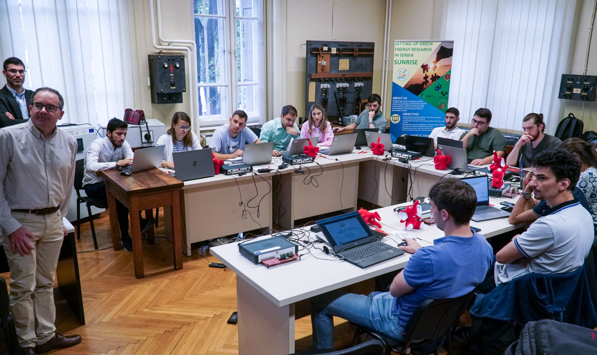

## 1st SUNRISE Summer School: A Fantastic Experience!

I recently participated in the 1st SUNRISE Summer School at the University of Belgrade. This incredible event brought together energy enthusiasts from across the globe for hands-on learning and lively discussions on Real-Time Applications for Renewable Energy Sources. The program featured practical sessions on protection relay testing, control hardware-in-the-loop (HIL) simulations, and engaging lectures delivered by top experts.

The SUNRISE project is a Twinning initiative coordinated by the University of Belgrade’s School of Electrical Engineering, in collaboration with Technische Universiteit Delft, the University of Seville, the University of the Basque Country, and the Business Technology Incubator of Technical Faculties in Belgrade. Its main objectives include advancing research excellence, management skills, and fostering international collaboration to support energy transition towards decarbonization.

## Key Highlights of the Workshop

1. **Protection Systems and Renewable Integration:** The sessions offered an in-depth look at the evolving role of protection systems in renewable energy networks. Hands-on demonstrations, such as protection relay testing and overcurrent protection modeling using HIL, were led by distinguished academics. These activities emphasized the need to adapt traditional systems to meet the demands of renewable energy integration.

2. **Voltage Source Converter (VSC) Control and Simulation:** Voltage Source Converters are pivotal in renewable energy systems, and this workshop showcased their importance through a series of lectures led by Prof. Manuel Barragán Villarejo and his team from the University of Seville. we have explored practical simulation techniques, including current control in rotating axes (dq) and reactive power management—key elements for maintaining system stability and efficiency.

3. **Hardware-in-the-Loop Applications:** The workshop’s finale focused on integrating hardware-in-the-loop systems for prototyping and testing VSC controllers. This hands-on session provid us with the opportunity to transition from theoretical concepts to experimental validation, highlighting the SUNRISE project’s contribution to advancing prototyping techniques for renewable energy applications.

## Networking and Cultural Experiences
Beyond technical knowledge, the workshop provided ample opportunities for networking through events like the joint gala dinner and a visit to the Nikola Tesla Museum. These activities allowed us to connect with peers and professionals while gaining insights into Serbia's rich history of innovation in electrical engineering.

## Personal Reflections
Attending the SUNRISE Summer School was an eye-opening experience, offering a rare blend of academic rigor, practical learning, and collaborative opportunities. The focus on real-time applications, especially in the context of renewable energy, aligns perfectly with the increasing need for innovative solutions in energy systems.

This event was not just a learning opportunity but also a celebration of the collaborative spirit that drives advancements in energy systems. From simulation to experimental validation, the lessons from this workshop are bound to shape future endeavors in the integration of renewable energy technologies.

