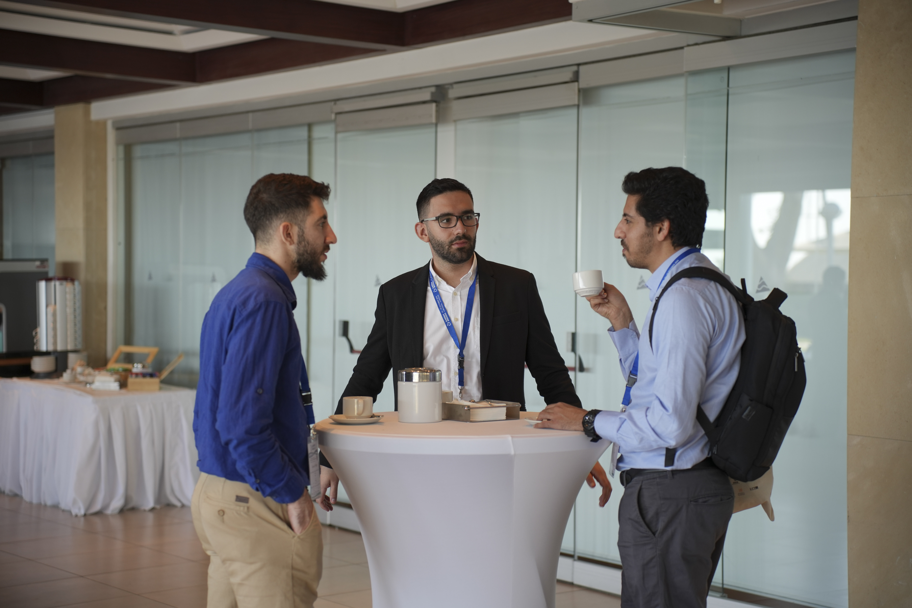

The SPS Lab proudly participated with three publications in the 2024 SyNERGY Conference, held in Cyprus. This prestigious event brought together academics, industry professionals, and researchers from around the globe to discuss the latest advancements in energy systems and sustainability. 

## Comparison of Fast Frequency Response Methods in the Low-Inertia Grid of Cyprus

We are thrilled to share that Andreas Argyrou, a talented bachelor student and past member of our lab, presented our paper titled "Comparison of Fast Frequency Response Methods in the Low-Inertia Grid of Cyprus" at this esteemed conference. The presentation highlighted the lab’s contribution to addressing frequency stability challenges in modern power grids, focusing on practical solutions for low-inertia systems with high renewable energy penetration.

### About the Research 

Modern electric power systems increasingly face frequency security challenges due to the high penetration of renewable energy sources (RES). The reduction of synchronous generators, combined with the limited ability of RES to provide frequency support, forces system operators to curtail RES or depend on Under Frequency Load Shedding schemes. Our research explored Fast Frequency Reserves (FFR) as a potential solution to strengthen frequency support in low-inertia systems. FFR can effectively mitigate critical issues such as the Rate of Change of Frequency (RoCoF), frequency nadir, and post-fault steady-state frequency. The study presented, analyzed, implemented, and compared five FFR control methods, assessing their effectiveness in alleviating frequency stability concerns.

The co-authors of this work are Savvas Panagi and Professor Dr. Petros Aristidou, whose guidance, collaboration, and support were instrumental in the success of this research. This project has received funding from the EU’s Horizon Europe Framework Programme (HORIZON) under the GA n. 101120278 - DENSE.

